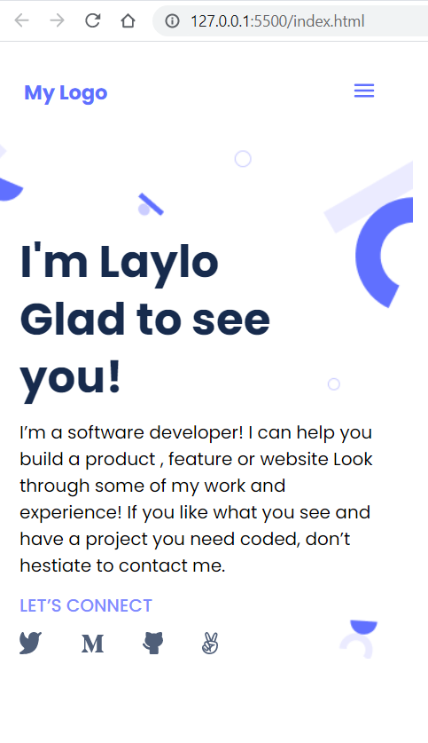

# Portfolio: setup and mobile version skeleton

## Learning objectives

- Understanding how to use FIGMA.
- Flexbox elements.
- Using Images.
- And of course building portfolio project.

## Built With

- HTML
- CSS

## Live Demo

[Live Demo Link](https://laylooo.github.io/My_Portfolio/)

## Getting Started

Just simply clone or download the project and open index.html file with your browser.

## Authors

👤 **Laylo**

- GitHub: [@githubhandle](https://github.com/Laylooo)
- Twitter: [@twitterhandle](https://twitter.com/home?lang=en)
- LinkedIn: [LinkedIn](https://www.linkedin.com/in/laylo-khodjaeva-05a972207/)

## 🤝 Contributing

Contributions, issues, and feature requests are welcome!

Feel free to check the [issues page](../../issues/).

## Show your support

Give a ⭐️ if you like this project!

## Acknowledgments

-Microverse

## 📝 License

This project is [MIT](./MIT.md) licensed.
